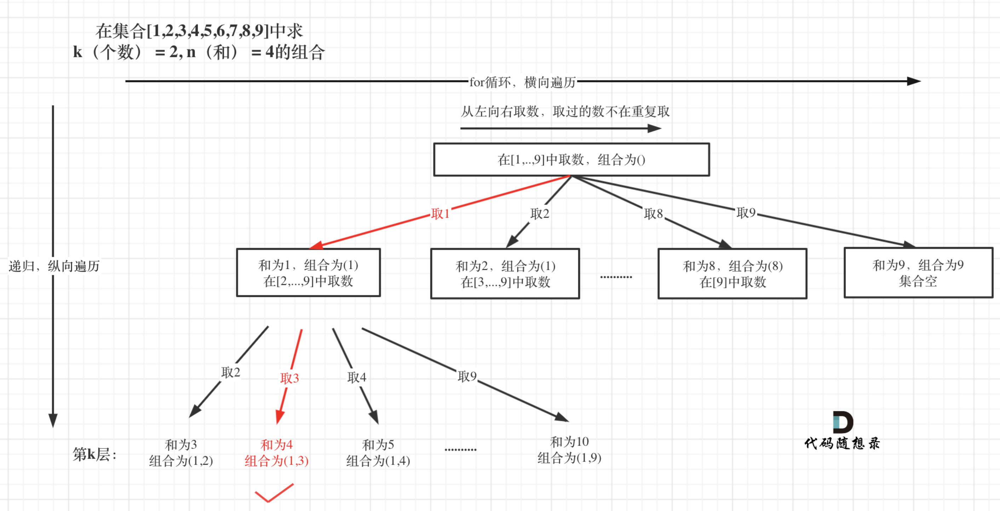

解题思路：
回溯问题，细节很多，但是也有一点套路：

- 先画出递归树，帮助分析；
- 代码实现，即使用 深度优先遍历，搜索 所有 可能的解（因为是遍历，所以可以得到所有的解）；
注意 
- 状态重置（恢复现场，以免出错）和 剪枝（避免不必要的搜索消耗时间），这一步没有技巧，根据一些特殊用例， 画图帮助分析，看清剪枝和结算的条件 。

```java
    public  void backtrack(int times, int start, int target) {
        // 终止条件    
        if(times == 0) {
                if (target == 0) {
                    result.add(new ArrayList<Integer>(list));
                    return;
                }
                return;
            }
        // 递归开始
        for (int i = start; i <= 9 ; i++) {
            // 剪枝
            if (i > target){
                break;
            }
            list.add(i);
            // times -1 表明限制递归深度，比如3个数字
            // i + 1 代表每个数限定使用1次
            backtrack(times -1, i+1, target-i);
            // 回溯
            list.remove(list.size()-1);
        }
    }

```